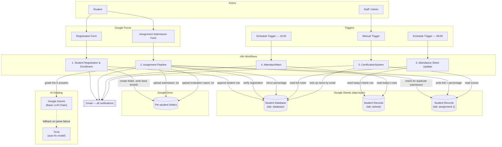

# Architecture

## 1. System overview

The platform is five independent n8n workflows that never call each other directly — they coordinate entirely through two shared Google Sheets and a shared Drive folder tree. That makes each workflow independently testable and independently schedulable, at the cost of the whole system's consistency depending on every workflow writing to the sheets in the shape the others expect.



## 2. Data layer design

### Student Database (spreadsheet, tab `database`)

One row per student — the master roster.

| Column | Written by | Notes |
|---|---|---|
| `Student ID` | Registration | Format `Mlit-<COURSE>-<mobile digits>`, e.g. `Mlit-BCA-9834` (first two + last two digits of the mobile number) |
| `Full Name` | Registration | `First Name + Last Name`, trimmed |
| `Email` | Registration | Trimmed, lower‑cased |
| `Mobile` | Registration | |
| `Course` | Registration | One of BCA / B.Tech / MBA / MCA / BBA / M.Tech |
| `Registration Date` | Registration | |
| `driveID` | Registration (write‑back step) | Google Drive folder ID created for this student |
| `assignment 1` | Assignment Pipeline (write‑back step) | Mirrors the graded percentage from `Student Records → assignment 1` |

### Student Records → `asheet` (attendance)

One row per student **per day**, keyed by a composite `Attendance ID`.

| Column | Written by |
|---|---|
| `Attendance ID` | Attendance Sheet Updater — `"<date>_<Student ID>"` |
| `Date` | Attendance Sheet Updater |
| `Student ID`, `Full Name`, `Course`, `email` | Attendance Sheet Updater (copied from Student Database) |
| `Attendance` | **Not set by any of these 5 workflows** — left blank when the row is seeded. Something outside this repo (a manual sheet edit, a faculty‑facing app, a scanner integration, etc.) is expected to fill in `P`/`A`. AttendaceWarn only *reads* this column. |

### Student Records → `assignment 1` (submissions & grades)

One row per student per assignment, keyed by `Student ID`.

| Column | Written by |
|---|---|
| `Student ID`, `Name`, `Email` | Assignment Pipeline (initial append) |
| `Assignment Link` | Assignment Pipeline — Drive link to the raw submission text file |
| `Result Report` | Assignment Pipeline — Drive link to the AI evaluation report text file |
| `Percentage` | Assignment Pipeline — from the Gemini/Groq grading step (see [Known Issues](README.md#known-issues--recommendations) — currently mis‑wired) |

### Google Drive

A single parent folder ("Student Database" in the source workflow) contains one sub‑folder per student, named `<Student ID> - <First Name>`, created during registration. The Assignment Pipeline later uploads two text files into that same folder per submission: the raw answers and the AI evaluation report.

## 3. Key flow: Assignment Pipeline (with AI grading)

This is the most involved of the five workflows, so it's worth tracing in detail — including its two rejection branches and the grading fallback.

```mermaid
sequenceDiagram
    participant S as Student
    participant F as Google Form
    participant WF as Assignment Pipeline
    participant DB as Student Database
    participant REC as assignment 1 (sheet)
    participant AI as Gemini (+ Groq auto-fix)
    participant GD as Google Drive
    participant GM as Gmail

    S->>F: Submit 5 answers
    F->>WF: On form submission
    WF->>DB: Look up by Email OR Student ID
    alt Student not found
        WF->>GM: "Verification Required" email
    else Student verified
        WF->>REC: Look up existing row by Email
        alt Submission already exists
            WF->>GM: "Already Submitted" email
        else First submission
            WF->>GD: Upload raw answers (.txt)
            WF->>REC: Append placeholder row (link, blank %)
            WF->>AI: Grade 5 answers against 25-mark rubric
            Note over AI: Structured Output Parser validates JSON;<br/>Groq retries/repairs on parse failure
            AI-->>WF: JSON — marks, feedback, total, %, grade, confidence
            WF->>GD: Upload evaluation report (.txt)
            WF->>REC: Update row (report link + percentage)
            WF->>DB: Mirror percentage onto roster
            WF->>GM: Evaluation summary email
        end
    end
```

**Grading rubric, as encoded in the workflow's system prompt:** 5 questions × 5 marks = 25 total. The model returns, per question, `marks` (0–5), `expectedAnswer`, and `feedback`; overall it returns `total`, `percentage` (`total / 25 × 100`), a letter `grade` (A+ down to F on a standard scale), an `overallSummary`, three `strengths`, three `improvements`, and a `confidence` score (0–100). Google Gemini is the primary model (`Basic LLM Chain`); Groq is wired only into the `Structured Output Parser`'s auto‑fix path, so it's used to repair malformed JSON rather than to grade independently.

## 4. Why this shape?

A few design choices worth calling out for anyone extending this:

- **Sheets as the database** keeps the whole stack Google‑only (no separate DB to host or secure), at the cost of no real transactions — two workflows racing to update the same row (e.g. two `appendOrUpdate` calls) could still clash under concurrent load.
- **Splitting into 5 workflows instead of 1** means attendance, grading, and certification can be scheduled/triggered independently and debugged in isolation — but it's also why the `Percentage` bug (see README) can quietly break a *downstream* workflow (CertificationSystem) without CertificationSystem itself containing any error.
- **A dedicated "auto‑fix" model (Groq) on the output parser** is a reasonable pattern for keeping structured‑output failures from surfacing as a broken node — retries stay inside the LLM step instead of failing the whole run.
