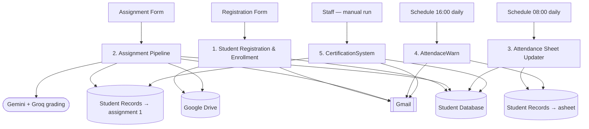

# Smart University Management Platform
### *MoonLit University — n8n Automation Suite*

A set of 5 interconnected [n8n](https://n8n.io) workflows that run a university's academic lifecycle end‑to‑end: student registration, daily attendance, AI‑graded assignments, absence alerts, and certification — with Google Sheets as the data layer, Google Drive for document storage, Gmail for every notification, and Google Gemini (with a Groq fallback) doing the assignment grading.

This repo packages those workflows together with documentation so the system can be understood, re‑deployed, or extended as one project rather than five loose files.

## Contents

- [Workflows at a glance](#workflows-at-a-glance)
- [Architecture](#architecture)
- [Data layer](#data-layer)
- [Tech stack](#tech-stack)
- [Repository structure](#repository-structure)
- [Getting started](#getting-started)
- [Known issues & recommendations](#known-issues--recommendations)
- [Before you publish this repo](#before-you-publish-this-repo)
- [Possible extensions](#possible-extensions)
- [License](#license)

## Workflows at a glance

| # | Workflow | File | Trigger | Purpose |
|---|----------|------|---------|---------|
| 1 | **Student Registration & Enrollment** | [`Student Registration & Enrollment.json`](Student%20Registration%20%26%20Enrollment.json) | Google Form submit | Validates a new registration, generates a Student ID, records the student, sends a welcome email, and provisions a personal Drive folder |
| 2 | **Assignment Pipeline** | [`Assignment PipeLine.json`](Assignment%20PipeLine.json) | Google Form submit | Verifies the student, blocks duplicate submissions, files the submission to Drive, grades it with Gemini (Groq as an auto‑fix fallback), and emails the result |
| 3 | **Attendance Sheet Updater** | [`Attendance Sheet Updater.json`](Attendance%20Sheet%20Updater.json) | Schedule (08:00 daily) / Manual | Seeds a blank attendance row for every student for the current day |
| 4 | **AttendaceWarn** *(Attendance Warning)* | [`AttendaceWarn.json`](AttendaceWarn.json) | Schedule (16:00 daily) / Manual | Emails every student marked absent that day |
| 5 | **CertificationSystem** | [`CertificationSystem.json`](CertificationSystem.json) | Manual | Issues a certificate or a "not completed" notice based on assignment score |

All five workflows share the same n8n project tag (`IITFINALPROJECT`) and the same Google Sheets / Gmail credentials, confirming they're meant to run as one system rather than independently.

Full node‑by‑node breakdowns of each workflow are in **[WORKFLOWS.md](WORKFLOWS.md)**.

## Architecture



This is the condensed view. **[ARCHITECTURE.md](ARCHITECTURE.md)** has the full system diagram, a sequence diagram of the Assignment Pipeline's AI grading branch, and the reasoning behind the data layout.

## Data layer

Two Google Sheets act as the entire database:

| Spreadsheet | Tab | Role | Written by | Read by |
|---|---|---|---|---|
| **Student Database** | `database` | Master roster (1 row per student) | Registration, Assignment Pipeline | All 5 workflows |
| **Student Records** | `asheet` | Daily attendance | Attendance Sheet Updater | AttendaceWarn |
| **Student Records** | `assignment 1` | Submissions & grades | Assignment Pipeline | CertificationSystem |

A parent **Google Drive** folder holds one sub‑folder per student (created at registration), which stores each student's raw assignment submission and AI evaluation report as text files.

## Tech stack

- **Orchestration:** [n8n](https://n8n.io) (Schedule, Form, Google Sheets, Google Drive, Gmail, Code, If, Split In Batches nodes)
- **Data store:** Google Sheets (used as a lightweight relational database)
- **File storage:** Google Drive
- **Notifications:** Gmail API
- **AI grading:** Google Gemini via `@n8n/n8n-nodes-langchain` (Basic LLM Chain + Structured Output Parser), with Groq as the parser's auto‑fix model
- **Scripting:** JavaScript (n8n Code nodes)

## Repository structure

```
smart_university_management_n8n/
├── README.md
├── ARCHITECTURE.md
├── WORKFLOWS.md
├── Student Registration & Enrollment.json
├── Assignment PipeLine.json
├── Attendance Sheet Updater.json
├── AttendaceWarn.json
└── CertificationSystem.json
```

## Getting started

1. **Prerequisites** — an n8n instance (cloud or self‑hosted), a Google account with Sheets/Gmail/Drive access, a Gemini API key, and a Groq API key.
2. **Create the data layer** — two Google Sheets:
   - *Student Database* → tab `database` with columns: `Student ID, Full Name, Email, Mobile, Course, Registration Date, driveID, assignment 1`
   - *Student Records* → tab `asheet` with columns: `Attendance ID, Date, Student ID, Full Name, Course, email, Attendance`, and a second tab `assignment 1` with columns: `Student ID, Name, Email, Assignment Link, Result Report, Percentage`
   - A parent folder in Google Drive to hold per‑student sub‑folders.
3. **Import the workflows** — in n8n: *Workflows → Import from File* for each workflow JSON in this repository.
4. **Reconnect credentials** — each node references the original author's credentials by ID, so every Google Sheets / Gmail / Google Drive / Gemini / Groq node will show "credential not found" until you map it to your own (see the credentials table in [WORKFLOWS.md](WORKFLOWS.md)).
5. **Point at your own sheets** — replace the two spreadsheet IDs and the Drive parent‑folder ID (currently hard‑coded in the nodes) with your own.
6. **Publish the two Google Forms** (Registration, Assignment Submission) using the field lists in [WORKFLOWS.md](WORKFLOWS.md), and re‑link each `On form submission` trigger.
7. **Fix the Percentage expression bug** before relying on grading or certification — see below.
8. **Activate** the two scheduled workflows (08:00 and 16:00) and test the rest manually with a dummy student end‑to‑end.

## Known issues & recommendations

These surfaced while reading through the workflow JSON — worth resolving before this is fully relied on:

1. **`Percentage` resolves to a schema type label, not a value.** In the Assignment Pipeline, the two result emails, the evaluation‑report text, and both sheet‑write nodes pull the grade via expressions like `{{ $('Basic LLM Chain').item.json.output.properties.percentage.type }}`. That path walks the *JSON Schema* given to the Structured Output Parser, so today it resolves to the literal word `"number"` rather than the actual score — the same pattern (`.properties.<field>.type`) appears **43 times** across every graded field (`total`, `percentage`, `grade`, `confidence`, `overallSummary`, `strengths`, `improvements`, and each question's `marks` / `expectedAnswer` / `feedback`). The fix is to drop `.properties` and `.type`, e.g. `{{ $('Basic LLM Chain').item.json.output.percentage }}`.
2. **Knock‑on effect on CertificationSystem.** Because of #1, the `Percentage` column in both the `assignment 1` sheet and `Student Database` is currently being written as the string `"number"`, so CertificationSystem's `Percentage > 0.4` check isn't evaluating real grades yet.
3. **A scale mismatch will remain once #1 is fixed.** The grading prompt defines `percentage` on a 0–100 scale (the emails print it as "Percentage: X %"), but CertificationSystem checks `Percentage > 0.4` — on a 0–100 scale that's true for almost any non‑zero score. Either change the threshold to `Percentage > 40`, or normalize the AI's output to a 0–1 fraction before it's written.
4. **Orphaned node.** `Message a model` (a direct Google Gemini node) in the Assignment Pipeline has no incoming or outgoing connections — it looks like a leftover from an earlier version of the grading step, before it moved to the `Basic LLM Chain` + `Structured Output Parser` combo. Safe to remove if unused.
5. **Cosmetic naming typos** (functionally harmless, but worth cleaning up if you revisit these workflows): the workflow named `AttendaceWarn` is missing an "n", and Registration's `Edit Fields1` node names its output `studentld` (lowercase "L") instead of `studentId`.

## Before you publish this repo

The workflow JSON files contain **real Google Sheet and Drive IDs** (not secrets — credentials themselves are stored separately and encrypted by n8n, and only referenced here by ID/name — but still identifiers pointing at real resources). Before making this repository public:

- Decide whether the repo should stay **private**, or
- Replace the spreadsheet/Drive IDs in the JSON with placeholders (e.g. `YOUR_SHEET_ID`) if you want it public as a portfolio piece.

## Possible extensions

- A dashboard workflow/view for staff to mark attendance (nothing in these 5 workflows currently *sets* the `Attendance` P/A value — it's seeded blank by workflow 3 and only *read* by workflow 4).
- A schedule trigger for CertificationSystem so certificates go out automatically once grading completes, instead of a manual run.
- Retry/error‑handling branches on the Gmail and Sheets nodes for production resilience.

## License

Released under the MIT License — add a `LICENSE` file if you publish this repository.

---

*Maintained by [Aryan Yadav](https://github.com/evotyindia).*
